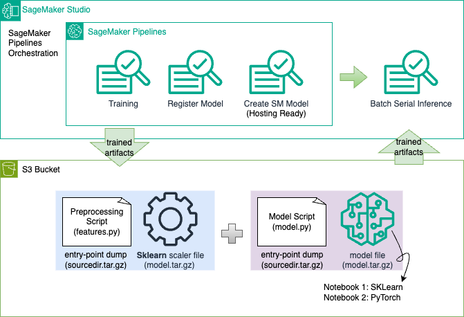
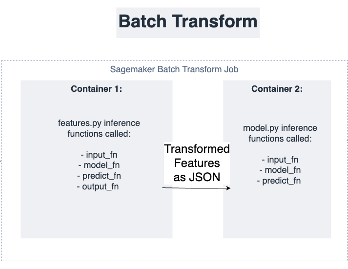

# SageMaker Batch Transform for Serial Inference with Pipeline Models (Sklearn -> PyTorch, Sklearn -> Sklearn)

This MLOps repository demonstrates serial inferencing with SageMaker Batch Transform. We provide two examples using SageMaker Pipelines for orchestration and model registration. 

Each example chains a feature building step (ex: fitting and serializing an SKLearn StandardScaler) to a model building step (ex: fitting and serializing a PyTorch or SKLearn model), followed by model registry of the resulting artifacts and Sagemaker Model creation (getting hosting ready). Passing the ARN of the Sagemaker Model into a Sagemaker Batch Transform call initializes serial inferencing across two containers (feature, model).

The custom script at each step (features.py, model.py) is the entry point for both training and inference of each step. You can apply these scripts as templates for your own custom feature-building and bring-your-own-model workflows.

Here is a diagram to show the high level structure:



## Quickstart
To get started, run either the `pytorch-demo` or `sklearn-demo` notebook end-to-end in a Jupyter Notebook IDE (ex: Sagemaker Studio with the Data Science 3.0 kernel). 

### Prerequisites
The dataset is automatically downloaded from AWS within each notebook. If you cannot download in your environment, it is also available at `../housing_data/raw/raw_data_all.csv`. 

You must update the `config.json` file for each example with your own S3 bucket name under `DEFAULT_BUCKET`. You must also update the bucket name used in the `INPUT_DATA` s3 path. If  you choose to change `PREFIX` you must also update the prefix in `INPUT_DATA`. Customize the other configs as desired. 

## Installation
Simply clone the repo and run the notebooks end-to-end in a data science IDE such as Sagemaker Studio with the Data Science 3.0 kernel. 

If you are running locally, create a new virtual envirionment and install packages with the command:

```terminal
 pip install -r requirements.txt
```

## Dataset Credits
We use the California housing dataset, from the StatLib repository. http://lib.stat.cmu.edu/datasets/

The target variable is the median house value for California districts. This dataset was derived from the 1990 U.S. census, using one row per census block group. A block group is the smallest geographical unit for which the U.S. Census Bureau publishes sample data (a block group typically has a population of 600 to 3,000 people).

## Serial Inferencing Tips on SageMaker

### Configure Inter-container Communication
Ensure proper communication between inference containers by configuring the `output_fn` of container 1 to be recieved by `input_fn` of container 2 in the same format (ex: JSON). 

The Batch Transform parameter `join_source='Input'` returns the output inference predictions from container 2 joined to the raw feature data input to inference. 



### Utilize Cache Config to Save Time
Save time by configuring a `CacheConfig` as demonstrated in the notebooks.

### Handling PING Error
If encountering a container PING error, verify the `sourcedir.tar.gz` file is generated correctly at each step.

### Utilizing FrameworkProcessor() for Feature Build Step vs SKLearnProcessor()
Choose between `FrameworkProcessor()` and `SKLearnProcessor()` based on your infrastructure needs. `FrameworkProcessor()` provides additional control over artifact locations.

### Framework-specific nuances to Artifact Handling
SageMaker follows framework-specific approaches to model artifact preparation for inference. The [PyTorchModel](https://sagemaker.readthedocs.io/en/stable/frameworks/pytorch/using_pytorch.html#create-a-pytorchmodel-object) class repacks `model.tar.gz`, while the [SKLearnModel](https://sagemaker.readthedocs.io/en/stable/frameworks/sklearn/sagemaker.sklearn.html#sagemaker.sklearn.model.SKLearnModel) class does not require this step. A generic [Model()](https://sagemaker.readthedocs.io/en/stable/frameworks/sklearn/sagemaker.sklearn.html#sagemaker.sklearn.model.SKLearnModel) class is also available if you want to handle artifact repacking manually. 

## Security

See [CONTRIBUTING](CONTRIBUTING.md#security-issue-notifications) for more information.

## License

This library is licensed under the MIT-0 License. See the LICENSE file.

## Authors and Acknowledgments
- Samantha Stuart - Associate Data Scientist | GitHub: [@hellosamstuart](https://github.com/hellosamstuart)
- Tan Xu - Senior Data & ML Architect
- Hisham Mohammad - Associate Data Scientist | Github: [@hishmania94](https://github.com/hishmania94)
